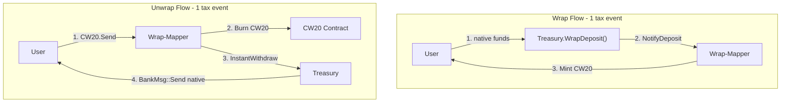

# Native Token Wrapping -- ustr-cmm

Plan to add native token wrapping support to the ustr-cmm contracts. The treasury holds all native LUNC/USTC backing for ecosystem auditability. A new wrap-mapper contract orchestrates CW20 minting/burning but never holds native tokens itself.

## Architecture



Tax optimization: native tokens flow directly user-to-treasury and treasury-to-user, achieving **1 tax event per wrap and 1 per unwrap** (the minimum possible on Terra Classic).

## 1. Upgrade Treasury Contract (`contracts/contracts/treasury/`)

The treasury currently has **no `migrate` entry point**. It uses `cw2::set_contract_version` in `instantiate`, and the `ustc-swap` contract in this repo has a working migrate pattern to follow.

### 1.1 Add migration support

Add to `src/msg.rs`:

```rust
pub struct MigrateMsg {}
```

Add to `src/lib.rs`:

```rust
pub use crate::contract::migrate;
```

Add `#[entry_point] pub fn migrate()` to `src/contract.rs` following the `ustc-swap` pattern:

1. `get_contract_version` and verify `contract == CONTRACT_NAME`
2. `set_contract_version` to new version
3. No state migration needed (new maps start empty)

### 1.2 New state

Add to `src/state.rs`:

```rust
pub const DENOM_WRAPPERS: Map<&str, Addr> = Map::new("denom_wrappers");
```

Maps native denom (e.g. `"uluna"`, `"uusd"`) to the trusted wrapper contract address. Governance-managed.

### 1.3 New messages

Add to `ExecuteMsg` in `src/msg.rs`:

```rust
SetDenomWrapper { denom: String, wrapper: String }     // governance-only
RemoveDenomWrapper { denom: String }                    // governance-only
WrapDeposit {}                                          // anyone, accepts info.funds
InstantWithdraw { recipient: String, asset: AssetInfo, amount: Uint128 }  // wrapper-only
```

Add query:

```rust
// QueryMsg
DenomWrappers {}  // returns all denom->wrapper mappings
```

### 1.4 New handlers

Add to `src/contract.rs`:

**`WrapDeposit {}`** -- mirrors the existing `SwapDeposit` pattern (line 474 of current contract.rs):

1. Validate `info.funds`: single native coin, non-zero amount
2. Look up `DENOM_WRAPPERS[denom]` -- error if no wrapper registered
3. Native tokens stay in treasury's balance (no transfer needed)
4. Call wrapper contract: `WasmMsg::Execute { msg: NotifyDeposit { depositor: info.sender, denom, amount }, funds: [] }`
5. Wrapper mints CW20 to depositor

**`InstantWithdraw { recipient, asset, amount }`** -- caller must be a registered wrapper:

1. Verify `info.sender` exists as a value in `DENOM_WRAPPERS`
2. For `AssetInfo::Native`: check balance, `BankMsg::Send` to recipient
3. For `AssetInfo::Cw20`: `CW20.Transfer` to recipient

**`SetDenomWrapper { denom, wrapper }`** -- governance-only:

1. Verify `info.sender == config.governance`
2. Validate wrapper address
3. Save `DENOM_WRAPPERS[denom] = wrapper`

**`RemoveDenomWrapper { denom }`** -- governance-only:

1. Verify `info.sender == config.governance`
2. Remove `DENOM_WRAPPERS[denom]`

### 1.5 New errors

Add to `src/error.rs`:

```rust
NoDenomWrapper { denom: String }
NotRegisteredWrapper {}
```

### 1.6 Why 1 tax event

- **Wrap**: User calls `treasury.WrapDeposit()` with native funds attached. Native tokens go directly from user to treasury = 1 tax event. No intermediate contract handles native tokens.
- **Unwrap**: Treasury calls `BankMsg::Send` directly to user = 1 tax event. Wrap-mapper never holds native tokens.

### 1.7 Files modified

- `contracts/contracts/treasury/src/msg.rs` -- MigrateMsg, new ExecuteMsg variants, new QueryMsg variant
- `contracts/contracts/treasury/src/contract.rs` -- migrate entry point, new handlers
- `contracts/contracts/treasury/src/state.rs` -- DENOM_WRAPPERS
- `contracts/contracts/treasury/src/error.rs` -- new error variants
- `contracts/contracts/treasury/src/lib.rs` -- export migrate

## 2. New Contract: `wrap-mapper` (`contracts/contracts/wrap-mapper/`)

Orchestrates CW20 minting/burning. **Never holds native tokens** -- those live in the treasury.

### 2.1 State (`src/state.rs`)

```rust
pub struct Config {
    pub governance: Addr,
    pub treasury: Addr,
    pub paused: bool,
}

pub const CONFIG: Item<Config> = Item::new("config");
pub const DENOM_TO_CW20: Map<&str, Addr> = Map::new("denom_to_cw20");
pub const CW20_TO_DENOM: Map<&str, String> = Map::new("cw20_to_denom");
pub const RATE_LIMITS: Map<&str, RateLimitConfig> = Map::new("rate_limits");
pub const RATE_LIMIT_STATE: Map<&str, RateLimitState> = Map::new("rate_limit_state");
```

### 2.2 Messages (`src/msg.rs`)

```rust
// InstantiateMsg
pub struct InstantiateMsg {
    pub governance: String,
    pub treasury: String,
}

// ExecuteMsg
pub enum ExecuteMsg {
    NotifyDeposit { depositor: String, denom: String, amount: Uint128 },  // treasury-only
    Receive(Cw20ReceiveMsg),               // CW20 hook for unwrap
    SetDenomMapping { denom: String, cw20_addr: String },  // governance
    RemoveDenomMapping { denom: String },   // governance
    SetRateLimit { denom: String, config: RateLimitConfig },  // governance
    RemoveRateLimit { denom: String },      // governance
    UpdateGovernance { new_governance: String },  // governance
    SetPaused { paused: bool },             // governance
}

// Cw20HookMsg (via CW20 Send)
pub enum Cw20HookMsg {
    Unwrap { recipient: Option<String> },
}

// QueryMsg
pub enum QueryMsg {
    Config {},
    DenomMapping { denom: String },
    AllDenomMappings {},
    RateLimit { denom: String },
}
```

### 2.3 Rate limit types

```rust
pub struct RateLimitConfig {
    pub max_amount_per_window: Uint128,
    pub window_seconds: u64,
}

pub struct RateLimitState {
    pub current_window_start: Timestamp,
    pub amount_used: Uint128,
}
```

Tracked globally per denom (not per-user, to prevent Sybil bypass).

### 2.4 Wrap flow (called by treasury via `NotifyDeposit`)

1. Verify `info.sender == config.treasury`
2. Look up `DENOM_TO_CW20[denom]`
3. Check rate limit for denom, check pause
4. Call CW20: `Mint { recipient: depositor, amount }`
5. Update rate limit state

### 2.5 Unwrap flow (called via CW20 Send hook)

1. Identify CW20 token from `info.sender` (the CW20 contract address)
2. Look up `CW20_TO_DENOM[info.sender]` to find the native denom
3. Check rate limit for denom, check pause
4. Burn received CW20: call `CW20.Burn { amount }` (wrap-mapper holds the balance after Send)
5. Call `treasury.InstantWithdraw { recipient, asset: Native { denom }, amount }`
6. Update rate limit state

### 2.6 Setup requirements

The wrap-mapper must be added as a minter on each CW20-mintable token via `AddMinter { minter: wrap_mapper_addr }`.

The treasury must register the wrap-mapper via `SetDenomWrapper { denom, wrapper: wrap_mapper_addr }` for each supported denom.

### 2.7 Files to create

- `contracts/contracts/wrap-mapper/Cargo.toml`
- `contracts/contracts/wrap-mapper/src/lib.rs`
- `contracts/contracts/wrap-mapper/src/contract.rs`
- `contracts/contracts/wrap-mapper/src/msg.rs`
- `contracts/contracts/wrap-mapper/src/state.rs`
- `contracts/contracts/wrap-mapper/src/error.rs`

### 2.8 Workspace changes

Add to `contracts/Cargo.toml` workspace members:

```toml
"contracts/wrap-mapper",
```

### 2.9 Dependencies

The wrap-mapper needs:
- `cosmwasm-std`, `cosmwasm-schema`, `cw-storage-plus`, `cw2`, `cw20`, `thiserror`, `schemars`, `serde`
- `common` (from `../../packages/common`) for `AssetInfo`

## 3. CW20 Token Deployment (LUNC-C and USTC-C)

Two new CW20-mintable tokens deployed using the existing `cw20-mintable` code (`contracts/external/cw20-mintable/`):

| Token | Symbol | Decimals | Backing |
|-------|--------|----------|---------|
| LUNC-C | LUNC-C | 6 | 1:1 native uluna |
| USTC-C | USTC-C | 6 | 1:1 native uusd |

After deployment:
1. Call `AddMinter { minter: wrap_mapper_addr }` on each CW20 token to authorize the wrap-mapper to mint.

---

## Test Plan

Tests use `cw-multi-test` following the existing inline test patterns in the repo.

### A. Treasury Contract Unit Tests

Add to treasury's inline `#[cfg(test)] mod tests` in `contracts/contracts/treasury/src/contract.rs`:

| # | Test | Validates |
|---|------|-----------|
| A1 | `test_set_denom_wrapper` | Governance can set denom->wrapper mapping; non-governance rejected |
| A2 | `test_remove_denom_wrapper` | Governance can remove mapping; removing non-existent is no-op |
| A3 | `test_wrap_deposit_success` | User sends native funds, wrapper notified with correct depositor/denom/amount |
| A4 | `test_wrap_deposit_unknown_denom` | Error when no wrapper registered for the sent denom |
| A5 | `test_wrap_deposit_multiple_coins` | Error when user sends multiple coin denoms |
| A6 | `test_wrap_deposit_zero_amount` | Error on zero-amount deposit |
| A7 | `test_instant_withdraw_native` | Registered wrapper can withdraw native to recipient, balance decreases |
| A8 | `test_instant_withdraw_unauthorized` | Non-wrapper caller is rejected |
| A9 | `test_instant_withdraw_insufficient` | Error when treasury lacks funds |
| A10 | `test_instant_withdraw_unknown_wrapper` | Error when caller is not in DENOM_WRAPPERS |
| A11 | `test_migrate_from_old_version` | Migration sets new version, existing state preserved |
| A12 | `test_migrate_wrong_contract` | Migration rejected for different contract name |
| A13 | `test_existing_features_after_migrate` | SwapDeposit, ProposeWithdraw, governance still work post-migration |

### B. Wrap-Mapper Contract Unit Tests

In `contracts/contracts/wrap-mapper/src/contract.rs` inline `#[cfg(test)] mod tests`:

| # | Test | Validates |
|---|------|-----------|
| B1 | `test_instantiate` | Governance and treasury set correctly |
| B2 | `test_set_denom_mapping` | Governance can set denom->CW20 mapping, both forward and reverse maps updated |
| B3 | `test_set_denom_mapping_unauthorized` | Non-governance rejected |
| B4 | `test_remove_denom_mapping` | Governance can remove mapping, both maps cleaned |
| B5 | `test_notify_deposit_mints_cw20` | Treasury calls NotifyDeposit, CW20 Mint message emitted with correct recipient/amount |
| B6 | `test_notify_deposit_unauthorized` | Non-treasury caller rejected |
| B7 | `test_notify_deposit_unknown_denom` | Error for unmapped denom |
| B8 | `test_unwrap_burns_and_withdraws` | CW20 sent via hook -> Burn message emitted, treasury.InstantWithdraw called |
| B9 | `test_unwrap_unknown_cw20` | Error when CW20 token not in any mapping |
| B10 | `test_unwrap_with_recipient` | Unwrap sends native to specified recipient (not CW20 sender) |
| B11 | `test_unwrap_default_recipient` | Unwrap with recipient=None sends to cw20_msg.sender |
| B12 | `test_rate_limit_wrap` | Wrap succeeds within limit, fails when exceeded |
| B13 | `test_rate_limit_unwrap` | Unwrap succeeds within limit, fails when exceeded |
| B14 | `test_rate_limit_window_reset` | After window_seconds, rate limit resets and operations succeed again |
| B15 | `test_rate_limit_separate_denoms` | LUNC and USTC rate limits tracked independently |
| B16 | `test_pause_blocks_wrap` | NotifyDeposit rejected when paused |
| B17 | `test_pause_blocks_unwrap` | Unwrap rejected when paused |
| B18 | `test_unpause_resumes` | Operations succeed after unpausing |
| B19 | `test_update_governance` | Governance can transfer to new address |
| B20 | `test_query_config` | Returns governance, treasury, paused state |
| B21 | `test_query_denom_mapping` | Returns correct CW20 for denom |
| B22 | `test_query_all_denom_mappings` | Returns all registered mappings |
| B23 | `test_query_rate_limit` | Returns config and current window usage |

### C. Integration Tests (treasury + wrap-mapper + CW20-mintable)

Create a new test file or test module. Deploy treasury, wrap-mapper, and CW20-mintable contracts in `cw-multi-test`:

| # | Test | Validates |
|---|------|-----------|
| C1 | `test_full_wrap_flow` | User -> treasury.WrapDeposit -> wrap-mapper.NotifyDeposit -> CW20 minted to user |
| C2 | `test_full_unwrap_flow` | User -> CW20.Send(wrap-mapper, Unwrap) -> burn -> treasury.InstantWithdraw -> native to user |
| C3 | `test_wrap_unwrap_roundtrip` | Wrap then unwrap: user native balance correct, treasury balance correct, CW20 supply = 0 |
| C4 | `test_multiple_denoms` | Wrap LUNC and USTC independently, unwrap each correctly |
| C5 | `test_rate_limit_end_to_end` | Wrap within limit succeeds, wrap exceeding limit fails, window reset allows again |
| C6 | `test_treasury_invariant` | After any sequence of wraps/unwraps, treasury native balance == total CW20 supply |
| C7 | `test_concurrent_users` | Multiple users wrap/unwrap, all balances consistent |
| C8 | `test_pause_blocks_full_flow` | Paused wrap-mapper blocks entire wrap and unwrap flows |

### D. Security Tests

| # | Test | Validates |
|---|------|-----------|
| D1 | `test_fake_notify_deposit` | Non-treasury caller can't mint CW20 via NotifyDeposit |
| D2 | `test_fake_instant_withdraw` | Non-wrapper caller can't drain treasury via InstantWithdraw |
| D3 | `test_wrap_unsupported_denom` | Wrapping a denom with no registered wrapper fails |
| D4 | `test_unwrap_unregistered_cw20` | Sending an unregistered CW20 to wrap-mapper fails |
| D5 | `test_rate_limit_sybil` | Multiple users collectively blocked by global rate limit |
| D6 | `test_governance_only_config_changes` | Only governance can SetDenomMapping, SetRateLimit, SetPaused |
| D7 | `test_paused_state_persists` | Pause survives across blocks |
| D8 | `test_treasury_balance_never_negative` | InstantWithdraw with amount > balance fails cleanly |
